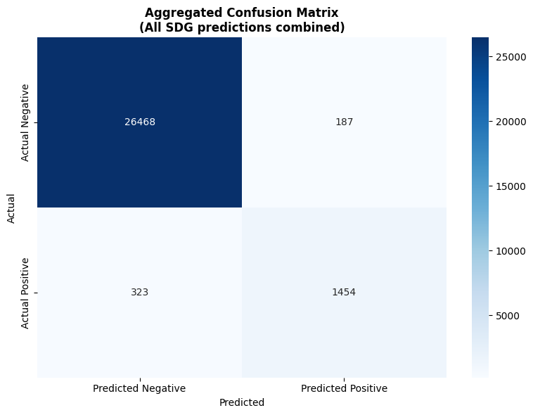
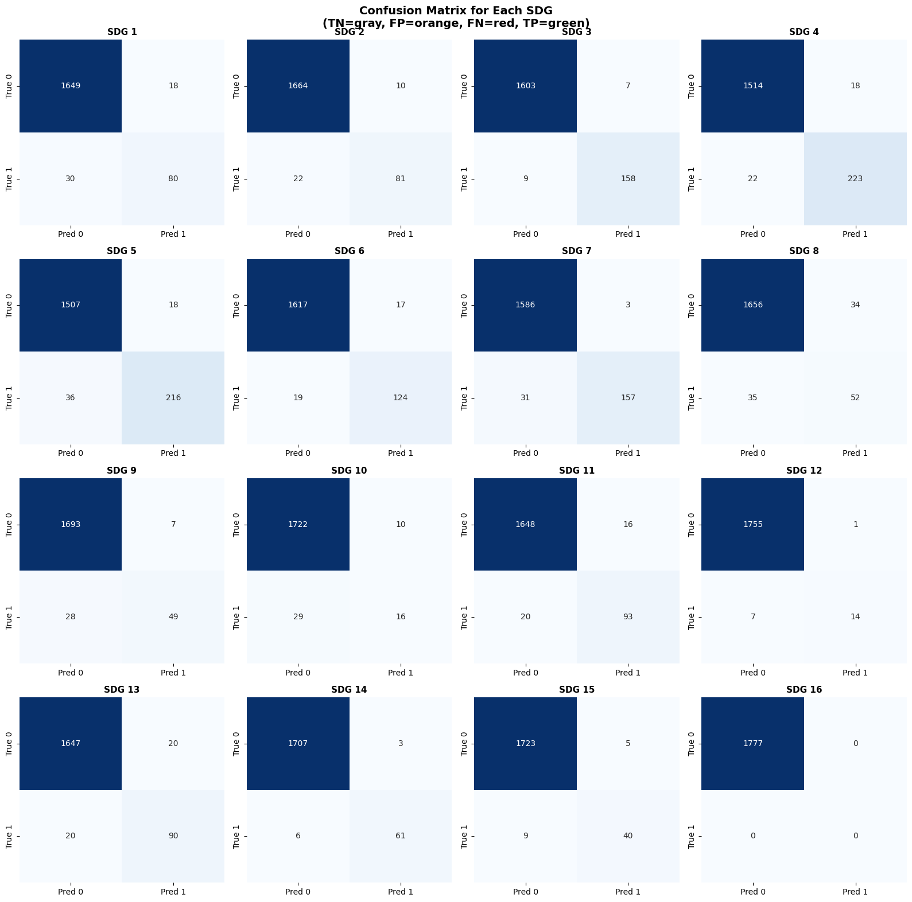

<p align="center">
  
</p>

<h1 align="center">🎓 SDG Thesis Classifier</h1>

<p align="center">
  <strong>An AI-powered tool for classifying academic research by UN Sustainable Development Goals</strong>
</p>

<p align="center">
  
  
  
  
  
</p>

---

## 📑 Table of Contents

- [About the Project](#-about-the-project)
  - [What are the UN SDGs?](#what-are-the-un-sdgs)
  - [Why Classify Theses by SDG?](#why-classify-theses-by-sdg)
- [Functional Requirements](#-functional-requirements)
  - [Data Collection and Preparation](#data-collection-and-preparation)
  - [Model Training and Deployment](#model-training-and-deployment)
  - [Front-End User Interface](#front-end-user-interface)
- [Non-Functional Requirements](#-non-functional-requirements)
  - [Performance](#performance)
  - [Usability](#usability)
  - [Security](#security)
  - [Authentication](#authentication)
- [Deviations from Original Requirements](#-deviations-from-original-requirements)
- [The Model](#-the-model)
  - [Why ModernBERT?](#why-modernbert)
  - [Why Multi-Label Classification?](#why-multi-label-classification)
  - [Training Data](#training-data)
  - [Performance Metrics](#performance-metrics)
  - [Confusion Matrices](#confusion-matrices)
- [Database Schema](#-database-schema)
  - [Entity-Relationship Diagram](#entity-relationship-diagram)
  - [Tables](#tables)
- [Report Generation](#-report-generation)
- [Project Structure](#-project-structure)
- [Getting Started](#-getting-started)
- [Team](#-team)

---

## 📖 About the Project

The **SDG Thesis Classifier** is a web-based application developed for Cal Poly Humboldt's library to automatically classify academic theses and dissertations according to the United Nations Sustainable Development Goals (SDGs).

### What are the UN SDGs?

The **17 Sustainable Development Goals** are a universal call to action adopted by all United Nations Member States in 2015. They provide a shared blueprint for peace and prosperity for people and the planet, now and into the future. The goals address global challenges including poverty, inequality, climate change, environmental degradation, and issues related to peace and justice.

| # | Goal | # | Goal |
|:-:|------|:-:|------|
| 1 | No Poverty | 10 | Reduced Inequalities |
| 2 | Zero Hunger | 11 | Sustainable Cities & Communities |
| 3 | Good Health & Well-being | 12 | Responsible Consumption & Production |
| 4 | Quality Education | 13 | Climate Action |
| 5 | Gender Equality | 14 | Life Below Water |
| 6 | Clean Water & Sanitation | 15 | Life on Land |
| 7 | Affordable & Clean Energy | 16 | Peace, Justice & Strong Institutions |
| 8 | Decent Work & Economic Growth | | |
| 9 | Industry, Innovation & Infrastructure | | |

### Why Classify Theses by SDG?

Academic research plays a crucial role in achieving sustainability goals, but discovering relevant research across disciplines has traditionally been challenging. By tagging thesis abstracts with SDG classifications, we enable:

- 🔍 **Cross-disciplinary Discovery** — Researchers can find related work across departments (e.g., a biologist studying marine ecosystems can find engineering research on water quality)
- 🤝 **Collaboration Opportunities** — Connect researchers working on similar sustainability challenges across campus
- 📊 **Impact Measurement** — Libraries can track and report on sustainability-related research output to administration and stakeholders
- 🌍 **Global Alignment** — Link local Cal Poly Humboldt research to global sustainability initiatives and funding opportunities

---

## ✅ Functional Requirements

### Data Collection and Preparation

| ID | Requirement | Status |
|----|-------------|--------|
| SR-1.1 | The system shall allow a Data Collector to import thesis abstracts from an external source (e.g., CSV file, plain text) into a temporary repository. | ✅ Implemented |
| SR-1.2 | The system shall provide a web-based interface for a Tagger to read a thesis abstract and manually apply one or more SDG tags from a predefined list. | ✅ Implemented |
| SR-1.3 | The system shall allow a Tagger to save the tagged abstract, including its metadata (e.g., title, author, date), to the dataset. | ✅ Implemented |
| SR-1.4 | The system shall implement a consensus-based review process where a second Tagger must approve the tags applied by the first Tagger before the data is finalized. | ⚠️ Modified (see [Deviations](#-deviations-from-original-requirements)) |

### Model Training and Deployment

| ID | Requirement | Status |
|----|-------------|--------|
| SR-2.1 | The system shall provide an interface for a Model Engineer to initiate the fine-tuning process for the ModernBERT model using the finalized dataset. | ✅ Implemented (Jupyter Notebook) |
| SR-2.2 | Upon completion of training, the system shall generate and display a report of key performance metrics (accuracy, precision, recall, F1-score) with at least 90% performance. | ✅ Implemented (98.2% F1) |
| SR-2.3 | The system shall allow a Model Engineer to deploy the newly trained model. Deployment shall not exceed 10 seconds. | ✅ Implemented (Hugging Face Spaces) |

### Front-End User Interface

| ID | Requirement | Status |
|----|-------------|--------|
| SR-3.1 | The system shall provide a single-page web interface with a text area for inputting a thesis abstract. | ✅ Implemented |
| SR-3.2 | The system shall provide a button to submit the abstract for processing. | ✅ Implemented |
| SR-3.3 | Upon submission, the system shall display a list of suggested SDG tags with confidence scores as percentages. | ✅ Implemented |
| SR-3.4 | The system shall provide the librarian with the ability to edit, add, or remove the suggested SDG tags. | ✅ Implemented |
| SR-3.5 | The system shall provide a "Save" button to finalize the tagging, which will then be exported to a CSV. | ⚠️ Modified (see [Deviations](#-deviations-from-original-requirements)) |

---

## 📋 Non-Functional Requirements

### Performance

| ID | Requirement | Status |
|----|-------------|--------|
| SR-4.1 | The system shall return SDG tags within 5 seconds for 95% of submissions. | ✅ Met (~2-3 seconds typical) |
| SR-4.2 | Initial model startup time shall not exceed 30 seconds. | ✅ Met (hosted on Hugging Face) |
| SR-4.3 | The system shall handle 10 concurrent requests without degradation. | ✅ Met (Hugging Face infrastructure) |

### Usability

| ID | Requirement | Status |
|----|-------------|--------|
| SR-5.1 | The UI shall be intuitive enough for first-time users to tag an abstract within 3 minutes without training. | ✅ Met |
| SR-5.2 | All interactive elements shall have clear and unambiguous labels. | ✅ Met |
| SR-5.3 | The system shall provide clear on-screen feedback for user actions. | ✅ Met |

### Security

| ID | Requirement | Status |
|----|-------------|--------|
| SR-6.1 | Data input mechanisms shall use parameterized queries to prevent SQL injection. | ✅ Implemented |
| SR-6.2 | The system shall use secure API endpoints and token-based authentication. | ⚠️ Modified (session-based auth) |

### Authentication

| ID | Requirement | Status |
|----|-------------|--------|
| SR-7.1 | The system shall require user authentication via username and password. | ✅ Implemented |
| SR-7.2 | The system shall integrate with MFA service (e.g., Duo Push). | ❌ Not Implemented (see [Deviations](#-deviations-from-original-requirements)) |

---

## 🔄 Deviations from Original Requirements

### 1. Consensus-Based Review Process (SR-1.4)

**Original:** Two taggers must approve before data is finalized.

**Implementation:** Single admin approval with confidence threshold system.

**Rationale:** The 75% confidence threshold provides automated quality control. Predictions above threshold are auto-approved; those below go to a pending queue for admin review. This streamlines the workflow while maintaining quality, which is essential for processing 6,000+ theses efficiently.

### 2. CSV Export (SR-3.5)

**Original:** Save button exports to CSV.

**Implementation:** Data saved to Oracle database with separate export functionality.

**Rationale:** Database storage enables:
- Persistent, queryable records
- Search functionality across all theses
- Statistical reporting and visualization
- Filtered exports (by year, SDG, date range)

### 3. Token-Based Authentication (SR-6.2)

**Original:** Token-based API authentication.

**Implementation:** PHP session-based authentication with secure cookies.

**Rationale:** Session-based auth is simpler for a single-application deployment and provides adequate security for the use case. The system runs on Cal Poly's secured infrastructure.

### 4. Multi-Factor Authentication (SR-7.2)

**Original:** Duo Push MFA integration.

**Implementation:** Username/password authentication only.

**Rationale:** MFA integration requires institutional coordination and infrastructure that was outside project scope. The system is deployed on internal university servers with existing network security measures.

### 5. Multi-Label vs Single-Label Classification

**Original:** Not explicitly specified.

**Implementation:** Multi-label classification allowing multiple SDGs per thesis.

**Rationale:** Research often spans multiple sustainability goals. A thesis on "Solar-powered water purification in rural communities" genuinely relates to SDG 6 (Clean Water), SDG 7 (Clean Energy), and SDG 11 (Sustainable Cities). Multi-label classification captures this complexity.

---

## 🤖 The Model

### Why ModernBERT?

We fine-tuned **[ModernBERT-base](https://huggingface.co/answerdotai/ModernBERT-base)** for SDG classification. ModernBERT was chosen over alternatives because:

| Feature | Benefit |
|---------|---------|
| Flash Attention | 2x faster inference than original BERT |
| 8192 token context | Handles long abstracts without truncation |
| Modern training data | Better understanding of recent terminology |
| Strong baselines | Top performance on text classification benchmarks |

### Why Multi-Label Classification?

| Approach | Loss Function | Output | Use Case |
|----------|---------------|--------|----------|
| Single-Label | CrossEntropyLoss | Softmax (sums to 1.0) | One category per item |
| **Multi-Label** | **BCEWithLogitsLoss** | **Sigmoid (independent)** | **Multiple categories per item** |

Our multi-label approach:
- Treats each SDG as an independent binary classification
- Outputs independent probabilities (don't sum to 1)
- Uses 75% threshold for automatic approval
- Shows top 3 predictions regardless of threshold

### Training Data

The model was trained on the **[OSDG Community Dataset](https://zenodo.org/records/5550238)**:
- ~17,000 text samples
- Labeled by domain experts
- Filtered for ≥70% annotator agreement
- Covers all 16 applicable SDGs (SDG 17 excluded as meta-goal)

### Performance Metrics

| Metric | Score | Description |
|--------|-------|-------------|
| **F1 Micro** | 98.20% | Overall F1 across all predictions |
| **F1 Macro** | 92.02% | Average F1 per SDG (unweighted) |
| **F1 Weighted** | 98.16% | Average F1 weighted by SDG frequency |
| **Precision** | 98.15% | Of predicted positives, % correct |
| **Recall** | 98.20% | Of actual positives, % found |

### Confusion Matrices

#### Aggregated Results (All SDGs Combined)

<p align="center">
  
</p>

|  | Predicted Negative | Predicted Positive |
|--|-------------------:|-------------------:|
| **Actual Negative** | 26,468 (TN) | 187 (FP) |
| **Actual Positive** | 323 (FN) | 1,454 (TP) |

- **True Negatives (26,468):** Correctly identified as NOT belonging to an SDG
- **False Positives (187):** Incorrectly predicted an SDG tag
- **False Negatives (323):** Missed an SDG that should have been tagged
- **True Positives (1,454):** Correctly identified SDG tags

#### Per-SDG Confusion Matrices

<p align="center">
  
</p>

The per-SDG matrices show performance varies by goal:
- **Strongest:** SDG 14 (Life Below Water), SDG 15 (Life on Land) — distinct terminology
- **Most Challenging:** SDG 8 (Decent Work), SDG 10 (Reduced Inequalities) — overlapping concepts

---

## 🗄️ Database Schema

### Entity-Relationship Diagram

```
┌─────────────────────┐
│    DEPARTMENTS      │
├─────────────────────┤
│ department_id (PK)  │
│ department_name     │
└──────────┬──────────┘
           │
           │ 1:N
           ▼
┌─────────────────────┐       ┌─────────────────────┐
│      THESES         │       │   PENDING_THESES    │
├─────────────────────┤       ├─────────────────────┤
│ thesis_id (PK)      │       │ pending_id (PK)     │
│ department_id (FK)  │       │ department_id (FK)  │
│ title               │       │ title               │
│ author              │       │ author              │
│ publication_date    │       │ publication_date    │
│ url                 │       │ url                 │
│ abstract (CLOB)     │       │ abstract (CLOB)     │
│ keywords (CLOB)     │       │ keywords (CLOB)     │
│ discipline          │       │ discipline          │
│ created_at          │       │ status              │
└──────────┬──────────┘       │ created_at          │
           │                  └──────────┬──────────┘
           │ 1:N                         │ 1:N
           ▼                             ▼
┌─────────────────────────────────────────────────────┐
│                   SDG_MAPPINGS                       │
├─────────────────────────────────────────────────────┤
│ mapping_id (PK)                                      │
│ thesis_id (FK) ─────────────────────────────────────│
│ pending_id (FK) ────────────────────────────────────│
│ sdg_number (1-16)                                    │
│ confidence_score (0.00-1.00)                         │
│ ranking (1, 2, 3...)                                 │
│ classification_method ('ai_auto'|'manual'|'admin')  │
│ created_at                                           │
└─────────────────────────────────────────────────────┘
```

### Tables

| Table | Purpose |
|-------|---------|
| `THESES` | Approved thesis records with full metadata |
| `PENDING_THESES` | Theses awaiting admin review (below 75% confidence) |
| `SDG_MAPPINGS` | Junction table linking theses to SDG tags with scores |
| `DEPARTMENTS` | Academic department lookup table |

### Classification Methods

| Value | Description |
|-------|-------------|
| `ai_auto` | AI prediction with ≥75% confidence, auto-approved |
| `manual_edit` | Librarian manually added or edited the tag |
| `admin_override` | Admin approved a below-threshold prediction |

---

## 📊 Report Generation

The Export page (`export_database.php`) provides comprehensive reporting capabilities:

### Features

1. **Filter Options**
   - By year (single year or range)
   - By specific SDGs (multi-select)
   - By date added to system

2. **Interactive Visualization**
   - Pie chart showing SDG distribution
   - Updates dynamically based on selected filters
   - Legend shows full SDG names (e.g., "1. No Poverty")
   - Grayed-out sections for filtered SDGs

3. **Export Formats**
   - CSV download with all metadata
   - PNG chart download for presentations
   - Filtered or complete database export

4. **Statistics Dashboard**
   - Total theses count
   - Theses per SDG breakdown
   - Pending review count
   - Date range of collection

---

## 📁 Project Structure

```
soft-eng-458/
│
├── 📄 README.md                    # This file
│
├── 📁 assets/                      # Images for README
│   ├── header.png
│   ├── confusion_matrix_aggregated.png
│   └── confusion_matrices_all_sdgs.png
│
├── 📁 website/                     # Web application
│   ├── index.php                   # Main classification interface
│   ├── export_database.php         # Export & reporting page
│   ├── app.js                      # Frontend JavaScript
│   ├── app.css                     # Styles
│   ├── save_thesis.php             # API: Save classifications
│   ├── search_api.php              # API: Search theses
│   ├── get_sdg_data.php            # API: Get statistics
│   ├── login_api.php               # API: Authentication
│   ├── logout.php                  # Session logout
│   ├── dbFunctions.php             # Database utilities
│   ├── hum_conn_no_login.php       # Database connection
│   └── exportResults.php           # CSV export handler
│
├── 📁 model/                       # ML model training
│   └── sdg_multilabel_training.ipynb
│
├── 📁 data_collection/             # Data gathering tools
│   ├── scrape_abstracts.py
│   └── General Workflow for Abstracts.txt
│
└── 📁 database/                    # Database setup
    └── databaseSchema.sql
```

---

## 🚀 Getting Started

### Prerequisites

- PHP 8.0+ with OCI8 extension
- Oracle Database
- Web server (Apache/Nginx)
- Python 3.11+ (for data collection)

### Installation

1. **Clone the repository**
   ```bash
   git clone https://github.com/EpicormicSprout/soft-eng-458.git
   cd soft-eng-458
   ```

2. **Set up the database**
   ```bash
   sqlplus username/password @database/databaseSchema.sql
   ```

3. **Configure database connection**
   
   Edit `website/hum_conn_no_login.php` with your Oracle credentials.

4. **Deploy to web server**
   
   Copy `website/` contents to your web root.

### Data Collection

To collect thesis abstracts from URLs:

1. Prepare a CSV with a `URL` column
2. Configure input/output filenames in `scrape_abstracts.py`
3. Run:
   ```bash
   cd data_collection
   python3 scrape_abstracts.py
   ```
4. Review output CSV and fix any incomplete abstracts
5. Import via the Bulk Upload feature in the web interface

---

## 👥 Team

**CS 458 – Software Engineering | Cal Poly Humboldt | Fall 2025**

| Role | Name | Responsibilities |
|------|------|------------------|
| Team Leader | Hayden Weber | Project management, timeline, coordination |
| Lead Programmer | Marceline Vazquez Rios | Core development, documentation |
| Lead Designer | Nick Michel | UI/UX, data collection tools |
| Quality Assurance | Courtney Rowe | Testing, requirements validation, model training |

---

<p align="center">
  <sub>Built for sustainable research discovery at Cal Poly Humboldt</sub>
</p>
